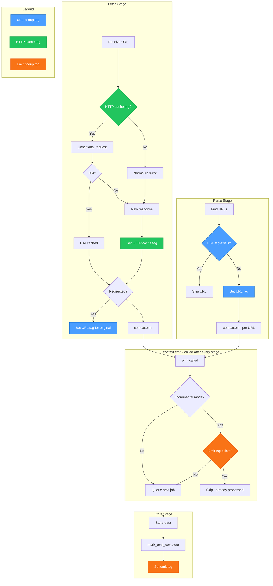

# Incremental Crawling

Memorious supports incremental crawling, which allows crawlers to skip previously processed items on subsequent runs. This significantly reduces redundant work and speeds up regular crawl updates.

## How It Works

Incremental crawling uses a tag-based system to track which items have been successfully processed. When enabled, memorious:

1. **On emit**: Checks if a cache key exists for the data being emitted
2. **If cached**: Skips the emit entirely (item was already processed)
3. **If not cached**: Proceeds with the emit and stores a cache key in the data
4. **On store**: Marks the cache key as complete after successful storage

This means items are only marked as "processed" after they reach a storage operation, ensuring that failed or incomplete processing doesn't prevent retries.

## Tag System Overview

The tag system is the backbone of memorious's incremental crawling. Tags are key-value pairs stored in a shared backend (S3, PostgreSQL, SQLite, Redis) that enable **coordination between distributed workers**.

### Tag Categories

| Category | Scope | Purpose |
|----------|-------|---------|
| **URL Deduplication** | Per-run | Prevent fetching the same URL twice within a crawl |
| **HTTP Response Cache** | Per-crawler | Enable conditional requests (304 Not Modified) |
| **Emit Deduplication** | Per-crawler | Skip already-processed items across runs |

### How Tags Flow Through a Crawl



### Tag Key Formats

```
# URL deduplication (per-run)
{crawler}/{run_id}/GET/example.com/path/to/page/a1b2c3d4...

# HTTP response cache (per-crawler)
{crawler}/GET/example.com/path/to/page/a1b2c3d4...

# Emit deduplication (per-crawler)
{crawler}/emit/GET/example.com/path/to/page/a1b2c3d4...
```

## Enabling Incremental Mode

Incremental mode is **enabled by default**. You can control it via:

### Environment Variable

```bash
# Disable incremental mode
export MEMORIOUS_INCREMENTAL=false

# Enable (default)
export MEMORIOUS_INCREMENTAL=true
```

### CLI Flag

```bash
# Run with incremental mode (default)
memorious run my_crawler.yml

# Run without incremental mode (reprocess everything)
memorious run my_crawler.yml --no-incremental
```

## Cache Key Generation

When `context.emit()` is called, memorious automatically generates a cache key from the data in this priority order:

1. **`emit_cache_key`**: If present in data, use this value directly
2. **`content_hash`**: If present (from fetched responses), use the content hash
3. **`url`**: If present, use a normalized hash of the URL

If none of these are available, no caching is performed for that emit.

### Custom Cache Keys

You can set a custom cache key by adding `emit_cache_key` to your data before emitting:

```python
def my_operation(context, data):
    # Use a custom identifier for caching
    data["emit_cache_key"] = f"document:{data['document_id']}:{data['version']}"
    context.emit(data=data)
```

This is useful when:

- The default keys (content_hash, url) don't uniquely identify your items
- You want to include version information in the cache key
- You're processing data that doesn't come from HTTP requests

## Tag Expiration

Incremental tags can expire after a configured period, forcing items to be reprocessed. Configure the expiration in days:

```bash
# Tags expire after 7 days (items will be reprocessed)
export MEMORIOUS_EXPIRE=7

# Default is 1 day
export MEMORIOUS_EXPIRE=1
```

## Storage and Completion

The incremental system uses a two-phase approach:

1. **Emit phase**: Cache key is generated and checked, but not yet marked complete
2. **Store phase**: After successful storage, `context.mark_emit_complete(data)` marks the key as complete

This ensures that if processing fails between emit and store, the item will be retried on the next run.

### Built-in Store Operations

The built-in storage operations (`directory`, `lakehouse`, `store`) automatically call `mark_emit_complete()`:

```yaml
pipeline:
  store:
    method: directory  # Automatically marks items complete
```

### Custom Operations

If you write a custom storage operation, call `mark_emit_complete()` after successful storage:

```python
def my_custom_store(context, data):
    # ... perform storage ...

    # Mark as complete for incremental skipping
    context.mark_emit_complete(data)
```

## Manual Incremental Checks

For more complex scenarios, you can use `context.skip_incremental()` to perform manual checks:

```python
def my_operation(context, data):
    # Check if this combination was already processed
    if context.skip_incremental(data["source"], data["document_id"]):
        context.log.info("Skipping already processed item")
        return

    # Process the item...
    process_document(data)
```

The `skip_incremental()` method:

- Returns `True` if the criteria combination was already processed (skip)
- Returns `False` if it's new (process it)
- Automatically marks the criteria as processed when returning `False`

## Tags Storage

By default, tags are stored alongside the archive. You can configure a separate storage location:

```bash
# Store tags in Redis
export MEMORIOUS_TAGS_URI=redis://localhost:6379/0

# Store tags in a specific directory
export MEMORIOUS_TAGS_URI=file:///data/memorious/tags

# Default: stored in the archive
```

## Example: Full Incremental Pipeline

```yaml
name: news_crawler
description: Crawl news articles incrementally

pipeline:
  init:
    method: seed
    params:
      url: https://example.com/news
    handle:
      pass: fetch

  fetch:
    method: fetch
    handle:
      pass: parse

  parse:
    method: parse
    params:
      store:
        mime_group: documents
    handle:
      fetch: fetch    # New URLs will be fetched
      store: store    # Documents will be stored

  store:
    method: directory
    # Items reaching here are marked complete
    # On next run, they'll be skipped at the emit stage
```

## Debugging Incremental Behavior

Enable debug logging to see incremental skip decisions:

```bash
export MEMORIOUS_DEBUG=true
memorious run my_crawler.yml
```

You'll see log messages like:

```
Skipping emit (incremental) cache_key=my_crawler/emit/abc123...
```

To force a full reprocessing, run without incremental mode:

```bash
memorious run my_crawler.yml --no-incremental
```

## Tag Scopes Explained

Understanding tag scopes is crucial for advanced usage:

### Per-Run Tags (URL Deduplication)

**Key format**: `{crawler}/{run_id}/...`

These tags prevent duplicate fetches **within a single crawl run**:

- When parse finds a link, it checks if any worker already queued it
- When fetch handles a redirect, it marks the original URL
- **Resets on each run** - URLs can be re-fetched in subsequent runs

This is intentional: the HTTP cache handles cross-run efficiency through conditional requests (304 Not Modified), while URL dedup handles within-run coordination.

### Per-Crawler Tags (HTTP Cache & Emit Dedup)

**Key format**: `{crawler}/...` (no run_id)

These tags persist across runs:

- **HTTP cache**: Stores response metadata (ETag, Last-Modified) for conditional requests
- **Emit dedup**: Tracks successfully processed items to skip on future runs

### Why URL Dedup is Per-Run

The current design separates concerns:

| Layer | Scope | Handles |
|-------|-------|---------|
| URL Dedup | Per-run | Multiple workers finding same link |
| HTTP Cache | Per-crawler | Avoiding re-download of unchanged content |
| Emit Dedup | Per-crawler | Avoiding re-processing of same documents |

**Benefits of per-run URL dedup:**

1. **Fresh discovery**: Each run can re-discover the site structure
2. **Error recovery**: Failed fetches in run 1 are retried in run 2
3. **Change detection**: Redirects and link changes are noticed
4. **HTTP cache handles efficiency**: Conditional requests return 304 for unchanged content

**Trade-off**: More requests per run, but most return 304 (fast, no body transfer).

## Flushing Tags

To completely reset incremental state:

```bash
# Via CLI
memorious run my_crawler.yml --flush

# Programmatically
crawler.flush_tags()
```

This deletes all tags for the crawler, forcing a complete re-crawl and re-processing.
